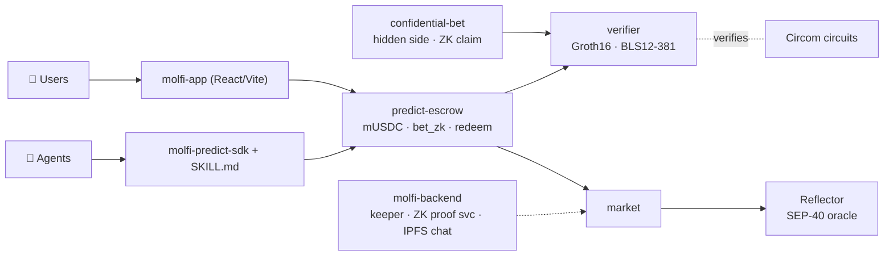

<div align="center">

# 🟣 Molfi

### Private, agent-native prediction markets on **Stellar**

[](https://stellar.org)
[](https://soroban.stellar.org)
[](https://github.com/nickthelegend/molfi-predict-circuits)
[](https://github.com/nickthelegend/molfi-predict-sdk)
[](https://reflector.network)

**Bet on real-world outcomes — your *side* stays hidden on-chain, proven with zero-knowledge.
And AI agents can trade the whole thing from a single skill file, no human in the loop.**

[Demo script](hackathon_submission.md) · [Contracts](https://github.com/nickthelegend/molfi-predict-contracts) · [Agent SDK](https://github.com/nickthelegend/molfi-predict-sdk) · [molfi.fun](https://molfi.fun)

</div>

---

## ✨ Why Molfi

- 🔒 **Private** — your YES/NO side is hidden on-chain behind a commitment; you claim your win with a zero-knowledge proof, unlinkable to your bet.
- 🤖 **Agent-native** — an LLM agent reads one `SKILL.md`, spins up a wallet, funds itself, places a **ZK-verified** bet, settles, and redeems — autonomously.
- ⛓️ **Really on-chain** — real `mUSDC` escrow, pari-mutuel payouts, and **Groth16 proofs verified inside the Soroban transaction** (BLS12-381, CAP-0059).
- 📈 **Live oracle** — markets settle from the real **Reflector** SEP-40 feed; a keeper auto-rolls 15m/30m crypto markets so the venue runs itself.

## 🧠 Three ZK mechanisms — all verified on-chain

| Mechanism | Proves | Contract |
|---|---|---|
| **ZK-gated bet** (`bet_zk`) | eligibility + single-use **nullifier**; every live bet carries a fresh proof checked on-chain before escrow | `predict-escrow` |
| **Confidential bet** | your **side is hidden** — prove in ZK you backed the *resolved winner* (winner injected as a public input, so losers can't prove), redeem unlinkably | `confidential-bet` |
| **Privacy pool** | Poseidon Merkle membership + nullifier withdraw | `privacy-pool` |

## 🤖 An agent trades it — no human

```ts
import { MolfiAgent } from "molfi-predict-sdk";

const agent = MolfiAgent.create();          // fresh Stellar wallet
await agent.onboard();                        // friendbot XLM + mUSDC faucet
await agent.betZk(marketId, 0, amount, proof, publicInputs, domain); // ZK bet, verified on-chain
await agent.resolveFromOracle(marketId);      // settle (permissionless after close)
await agent.redeem(marketId);                 // claim winnings
```

> **Proven live** — an autonomous agent (`GD7ZRQ7B…`) ran the *entire* lifecycle and redeemed a **+96 mUSDC profit**:
> [`bet_zk`](https://stellar.expert/explorer/testnet/tx/0e9bca76a9344796e9aee9ab9b1a4ea94dc17fa5a411dadfc074fc43dd0d7b72) (Groth16 on-chain + nullifier burned) → [`resolve`](https://stellar.expert/explorer/testnet/tx/d1eb6e7c4f0091caa43760ae73f3b5fa729933bb23f62cbedb22b8a8a4dd214c) → [`redeem`](https://stellar.expert/explorer/testnet/tx/09f89119c8394a3f2cc10d099093a9e1a863f0641e743e26db2b474cfc7b715e)

## 🏗️ Architecture



## 🚀 Quickstart

```bash
# Backend — market engine + keeper + ZK proof service
cd molfi-backend && npm install && cp .env.example .env   # set MONGODB_URI, MOLFI_ADMIN_SECRET, PINATA_JWT
npm start                        # → http://localhost:4000

# Web app
cd ../molfi-app && npm install && npm run dev              # → http://localhost:8082
```

Open the app → **Connect** (Freighter, testnet) → **Faucet** → open a Crypto market → bet (Standard or 🔒 Private).

**Run the full agent lifecycle in one command:**

```bash
cd molfi-contracts && bash scripts/zk_onchain_bet.sh
# fresh wallet → faucet → bet_zk (Groth16 on-chain) → resolve → redeem
```

## 📜 Deployed contracts (Stellar testnet)

| Contract | ID |
|---|---|
| verifier (Groth16) | `CCTJUV6I5WVOLF7DQUZ2NX6ZJD2AWCGDBCEIN2SBFOWNLZP7MYV2ZXEC` |
| predict-escrow | `CCMR7AL3QT57B7KRZQ47AH34E4OQH42JXUK6BE7SQKRVOIJKAVILURL7` |
| confidential-bet | `CBJO7AZHJSS4JZFTFYHZWK7B2ZZNZ4OUQMAZ53YAJCMJB3M7HHHISJXA` |
| market | `CDDX7ELEU2XBQWYYS72BFKZN5M642EBLEA6N2X22WZTHNGXPF7YPAXP3` |
| Reflector oracle | `CCYOZJCOPG34LLQQ7N24YXBM7LL62R7ONMZ3G6WZAAYPB5OYKOMJRN63` |
| mUSDC (faucet) | `CD4J6V73L5LBHDPCDITB2SMZQK5URUFBDED5IGTEU4G6XOUYXYUBJYST` |

## 🧾 Live proof — real transactions

Explorer: `https://stellar.expert/explorer/testnet/tx/<hash>`

| Flow | Transaction |
|---|---|
| Live ZK bet (`bet_zk`, Groth16 on-chain) | `82ec3633…d883e7d5bb0735ecdb6c06a574dc2cf95d3c066e4f9509e575f632ce` |
| Confidential claim (side hidden) | `63a587b6…56a7f4af4cbfba9a0bb3055192a5a1340d3f970fd419bef413eeb6d3` |
| Agent lifecycle — `bet_zk` | `0e9bca76a9344796e9aee9ab9b1a4ea94dc17fa5a411dadfc074fc43dd0d7b72` |
| Agent lifecycle — redeem (+96 mUSDC) | `09f89119c8394a3f2cc10d099093a9e1a863f0641e743e26db2b474cfc7b715e` |

## 📦 Repositories

| Repo | Contents |
|---|---|
| [molfi-predict-app](https://github.com/nickthelegend/molfi-predict-app) | Web app (React + Vite + Tailwind) |
| [molfi-predict-backend](https://github.com/nickthelegend/molfi-predict-backend) | Market engine, keeper, ZK + confidential proof service, IPFS chat |
| [molfi-predict-sdk](https://github.com/nickthelegend/molfi-predict-sdk) | Agent SDK + `SKILL.md` |
| [molfi-predict-contracts](https://github.com/nickthelegend/molfi-predict-contracts) | Soroban contracts (Rust) |
| [molfi-predict-circuits](https://github.com/nickthelegend/molfi-predict-circuits) | Circom ZK circuits + Groth16 keys |
| [molfi-predict-landing](https://github.com/nickthelegend/molfi-predict-landing) | Landing page |
| [molfi-predict-docs](https://github.com/nickthelegend/molfi-predict-docs) | Architecture · roadmap · submission |

## 🎬 Demo & submission

The full recording guide + spoken **narration script** (humans-trade act → agents-trade climax) is in
**[hackathon_submission.md](hackathon_submission.md)**.

## ⚠️ Honest status

Real on-chain market, on-chain **Groth16-verified** bets, autonomous oracle settlement, and the
agent SDK are all live on testnet. The confidential bet's anonymity *set* is a single-leaf path
today (side-hiding, outcome-binding, and nullifiers are real on-chain) — a shared BLS12-381
Poseidon accumulator + client-side proving is the production follow-up. Testnet only.

<div align="center">

**Built on Stellar · Soroban · Circom / Groth16 (BLS12-381) · Reflector · IPFS**

</div>
